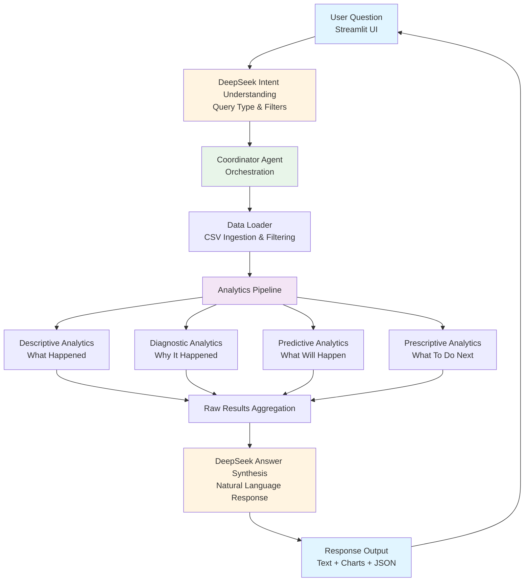

# Sales Intelligence Agentic System

Conversational sales analytics that answers **what happened, why it happened, what will happen, and what to do next**. The solution combines Streamlit, DeepSeek, and modular analytics pipelines (descriptive, diagnostic, predictive, prescriptive) with optional FastAPI endpoints for integrations.

## 🔄 System Workflow



## 🚀 Quick Start (Windows PowerShell)

1. Open PowerShell in the project folder.
2. Run:
   ```powershell
   .\run_streamlit_venv.ps1
   ```

3. The chat UI launches at `http://localhost:8501` – ask questions like “Which region has the highest sales?” or “Why did sales drop in Khulna?”

> The script automatically creates the `.venv` environment (if missing), installs dependencies, and starts Streamlit.

## 🐧 macOS / Linux Quick Start

```bash
python3 -m venv .venv
source .venv/bin/activate
pip install --upgrade pip
pip install -r requirements.txt
export DEEPSEEK_API_KEY="YOUR_KEY"
streamlit run ui/chat_demo.py
```

## 🔌 Optional: FastAPI Service

Start the REST API (after dependencies are installed):
```powershell
.\.venv\Scripts\python.exe run_api.py
```
Endpoints available at `http://localhost:8000` (`/docs` for Swagger UI).

## 📂 Project Layout

```
data/                    Sample sales dataset (CSV)
ui/chat_demo.py          Streamlit conversational UI
src/
  agents/                Coordinator + LLM integration
  descriptive_analytics.py  "What happened" logic
  diagnostic_analytics.py   Dip/anomaly detection
  predictive_analytics.py   Forecasting pipeline
  prescriptive_analytics.py Recommendation engine
api/fastapi_endpoint.py  FastAPI entry point
DOCS/                    Project documentation suite
run_streamlit_venv.ps1   One-command launcher (Windows)
requirements.txt         Python dependencies
```

## 📘 Documentation

Detailed write-ups are under `DOCS/`, including:
- `01_PROJECT_OVERVIEW.md` – executive summary
- `02_TECHNICAL_ARCHITECTURE.md` – component & data-flow details
- `03_ANALYTICS_DEEP_DIVE.md` – analytics logic

## 🧪 Sample Data

`data/sample_sales.csv` ships with realistic multi-region transactions for quick demos and testing.

Enjoy exploring your sales data with natural-language intelligence!

